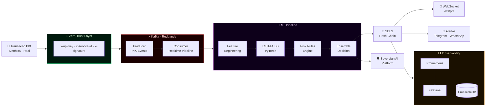
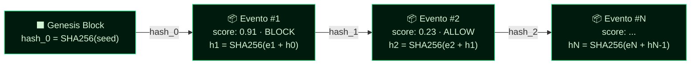

<div align="center">


<br/>


<br/><br/>


<br/>


<br/>


<br/>


</div>

<br/>

> [!WARNING]
> Esta plataforma utiliza **exclusivamente dados públicos e sintéticos**. É uma extensão direta do `Fraud-Master-Bank`, adicionando um módulo PIX especializado para o contexto regulatório brasileiro — **BACEN + LGPD**.

<br/>

---

## 📑 Índice

<div align="center">

| | Seção | | Seção |
|:---:|:---|:---:|:---|
| 🟢 | [Visão Geral](#-visão-geral) | 🤖 | [Modelo LSTM AIDS](#-modelo-lstm-aids) |
| 🏗️ | [Arquitetura](#-arquitetura-em-tempo-real) | 🔗 | [SELS — Ledger Imutável](#-sels--ledger-imutável) |
| ⚡ | [Pipeline de Decisão](#-pipeline-de-decisão) | 🔐 | [Zero-Trust Security](#-zero-trust-security) |
| 🛠️ | [Stack Tecnológico](#-stack-tecnológico) | 🚨 | [Alertas em Tempo Real](#-alertas-em-tempo-real) |
| 📂 | [Estrutura do Projeto](#-estrutura-do-projeto) | 📊 | [Observabilidade](#-observabilidade) |
| 🚀 | [Quick Start](#-quick-start) | 🛡️ | [Sovereign AI](#-integração-sovereign-ai) |
| 🌐 | [Serviços & Portas](#-serviços--portas) | ☁️ | [Infraestrutura AWS](#-infraestrutura-aws) |
| 📡 | [Endpoints PIX](#-endpoints-pix) | 🧪 | [Testes](#-testes) |

</div>

<br/>

---

## 🟢 Visão Geral

Plataforma de detecção de fraudes em transações **PIX** com latência inferior a **1 segundo**, construída sobre streaming Kafka/Redpanda, modelo LSTM AIDS em PyTorch, zero-trust middleware e ledger de auditoria imutável baseado em hash-chain (**SELS**). Referência técnica para times de prevenção a fraudes, compliance e forensic analytics no ecossistema financeiro brasileiro.

```
╔══════════════════════════════════════════════════════════════════════════╗
║                    PIX FRAUD REALTIME  ·  FLUXO PRINCIPAL               ║
╠══════════════════════════════════════════════════════════════════════════╣
║                                                                          ║
║   📱 Transação PIX                                                       ║
║        │                                                                 ║
║        ▼                                                                 ║
║   [ 🔐 Zero-Trust Middleware ]  ──►  [ 📡 Kafka / Redpanda Producer ]   ║
║                                               │                          ║
║                                      ┌────────▼────────┐               ║
║                                      │  Kafka Consumer  │               ║
║                                      └────────┬────────┘               ║
║                                               ▼                          ║
║              [ ⚙️  Feature Pipeline PIX ]  ──►  [ 🧠 LSTM AIDS Score ]   ║
║                                               ▼                          ║
║                              [ 🔗 SELS Hash-Chain Ledger ]              ║
║                                               │                          ║
║        ┌──────────────────────────────────────┼────────────────────┐    ║
║        ▼                                      ▼                    ▼    ║
║  [ 🔌 WebSocket ]        [ 🚨 Telegram / WhatsApp ]      [ 📊 Metrics ] ║
║  [ 🛡️  Sovereign AI ]     [ 📈 Grafana Dashboard ]        [ TimescaleDB]║
╚══════════════════════════════════════════════════════════════════════════╝
```

<br/>

---

## 🏗️ Arquitetura em Tempo Real



<br/>

---

## ⚡ Pipeline de Decisão

<div align="center">

| Etapa | Tecnologia | Latência Típica |
|:---:|:---|:---:|
| 🔐 Ingestão Zero-Trust | FastAPI Middleware | ~2ms |
| 📡 Produção Kafka | Redpanda Producer | ~5ms |
| ⚙️ Feature Engineering | pandas · Feature Store | ~15ms |
| 🧠 Inferência LSTM | PyTorch · CUDA opcional | ~50ms |
| 🔗 Escrita SELS | SHA-256 · PostgreSQL | ~10ms |
| 🔌 Broadcast WebSocket | FastAPI WS | ~3ms |
| **✅ Total p99** | **Pipeline completo** | **`< 1000ms`** |

</div>

<br/>

---

## 🛠️ Stack Tecnológico

```
╔══════════════════════════════════════════════════════════════════════╗
║  CAMADA               TECNOLOGIAS                                    ║
╠══════════════════════════════════════════════════════════════════════╣
║  API & Streaming      FastAPI · Uvicorn · WebSocket                  ║
║                       Kafka (Redpanda) Producer / Consumer           ║
╠══════════════════════════════════════════════════════════════════════╣
║  Machine Learning     PyTorch · LSTM AIDS (bidirecional)             ║
║                       Feature Pipeline PIX · Feature Store           ║
║                       Scaler JSON · Reason Codes                     ║
╠══════════════════════════════════════════════════════════════════════╣
║  Storage              TimescaleDB  (PostgreSQL time-series)          ║
║                       SELS  ·  Secure Event Ledger (hash-chain)      ║
╠══════════════════════════════════════════════════════════════════════╣
║  Segurança            Zero-Trust Middleware (API Key + Service ID)   ║
║                       SELS Hash-Chain · Assinatura HMAC opcional     ║
║                       LGPD Compliance · Eventos anonimizados         ║
╠══════════════════════════════════════════════════════════════════════╣
║  Alertas              Telegram Bot API · WhatsApp Business API       ║
╠══════════════════════════════════════════════════════════════════════╣
║  Observabilidade      Prometheus · Grafana (dashboards pré-config)   ║
╠══════════════════════════════════════════════════════════════════════╣
║  Infraestrutura       Terraform · AWS sa-east-1 · Docker Compose     ║
╠══════════════════════════════════════════════════════════════════════╣
║  Integração           Sovereign AI Security Platform (webhook)       ║
║                       Fraud-Master-Bank (base reutilizada)           ║
╚══════════════════════════════════════════════════════════════════════╝
```

<br/>

---

## 📂 Estrutura do Projeto

<details>
<summary><b>🗂️ Expandir estrutura completa</b></summary>

<br/>

```
PIX-Fraud-RealTime/
│
├── 🧠 src/
│   ├── Backend/                    # Infraestrutura base (Fraud-Master-Bank)
│   ├── db/                         # Modelos de banco e migrações
│   │
│   ├── pix/                        # ★ Módulo PIX especializado
│   │   ├── api/                    # Routers FastAPI PIX
│   │   ├── mock/                   # Transações PIX sintéticas (padrões BR)
│   │   ├── features/               # Feature engineering PIX
│   │   ├── feature_store/          # Cache de features para scoring <1s
│   │   ├── ml/
│   │   │   ├── aids_lstm.py        # Arquitetura LSTM AIDS (PyTorch)
│   │   │   └── train_lstm.py       # Treinamento + export checkpoint .pt
│   │   ├── security/               # Zero-Trust middleware + SELS
│   │   ├── services/               # Processamento, scoring, alertas
│   │   ├── streaming/              # Kafka Producer / Consumer PIX
│   │   └── ws/                     # WebSocket broadcast de decisões
│   │
│   └── sovereign/                  # Integração Sovereign AI Platform
│
├── 🤖 models/
│   └── aids_scaler.json            # Scaler serializado do LSTM
│
├── 📊 prometheus/                  # Scrape configs
├── 📈 grafana/
│   ├── dashboards/                 # Dashboards JSON pré-provisionados
│   └── provisioning/               # Auto-provisionamento
│
├── ☁️  infrastructure/terraform/    # IaC AWS sa-east-1
├── 🐳 docker/                      # Dockerfiles por serviço
├── 📓 notebooks/                   # Análise exploratória
├── 🧪 tests/                       # pytest + validação latência <1s
├── ⚙️  config/                      # Configurações por ambiente
│
├── docker-compose.yml
├── pyproject.toml
├── requirements.txt
└── .env.example
```

</details>

<br/>

---

## 🚀 Quick Start

**Pré-requisitos:** `Docker >= 24` · `docker compose >= 2` · `Python >= 3.11`

<br/>

<table>
<tr>
<th align="center">🐧 Linux / macOS</th>
<th align="center">🪟 Windows (PowerShell)</th>
</tr>
<tr>
<td>

```bash
# 1. Clone o repositório
git clone https://github.com/maykonlincolnusa/PIX-Fraud-RealTime.git
cd PIX-Fraud-RealTime

# 2. Configure variáveis de ambiente
cp .env.example .env

# 3. Suba a stack completa
docker compose up -d --build
```

</td>
<td>

```powershell
# 1. Clone o repositório
git clone https://github.com/maykonlincolnusa/PIX-Fraud-RealTime.git
cd PIX-Fraud-RealTime

# 2. Configure variáveis de ambiente
Copy-Item .env.example .env

# 3. Suba a stack completa
docker compose up -d --build
```

</td>
</tr>
</table>

<br/>

---

## 🌐 Serviços & Portas

<div align="center">

| Serviço | URL | Credenciais |
|:---:|:---|:---:|
| ⚡ **API REST** | http://localhost:8000 | — |
| 📄 **Swagger UI** | http://localhost:8000/docs | — |
| 🔌 **WebSocket PIX** | `ws://localhost:8000/ws/pix` | `x-api-key` header |
| 📈 **Prometheus** | http://localhost:9090 | — |
| 📊 **Grafana** | http://localhost:3000 | `admin / admin` |
| 🗄️ **TimescaleDB** | `localhost:5432` | via `.env` |
| 🔴 **Redpanda** | `localhost:9092` | — |

</div>

<br/>

---

## 📡 Endpoints PIX

> [!IMPORTANT]
> Todos os endpoints `POST /api/v1/pix/*` exigem os headers Zero-Trust obrigatórios: **`x-api-key`** e **`x-service-id`**.

<div align="center">

| Método | Endpoint | Descrição |
|:---:|:---|:---|
| `POST` | `/api/v1/pix/score` | 🎯 Score de fraude online · **< 1s** |
| `POST` | `/api/v1/pix/mock/publish` | 📡 Publicar stream sintético no Kafka |
| `GET` | `/api/v1/pix/sels/verify` | 🔗 Verificar integridade do hash-chain |
| `GET` | `/api/v1/pix/alerts` | 🚨 Listar alertas de fraude PIX |
| `WS` | `/ws/pix` | 🔌 WebSocket — broadcast realtime |
| `GET` | `/health` | 💚 Health check |
| `GET` | `/metrics` | 📈 Prometheus metrics |

</div>

<br/>

<details>
<summary><b>📋 Exemplo · Score Online</b></summary>

<br/>

```bash
curl -X POST http://localhost:8000/api/v1/pix/score \
  -H "Content-Type: application/json"              \
  -H "x-api-key: local-dev-key"                    \
  -H "x-service-id: ops-console"                   \
  -d '{
    "payer_id":              "payer_1001",
    "payee_id":              "payee_9001",
    "amount":                23500,
    "city":                  "Sao Paulo",
    "state":                 "SP",
    "is_new_beneficiary":    true,
    "device_trust_score":    0.31,
    "failed_auth_count_24h": 4
  }'
```

**Resposta esperada:**

```json
{
  "transaction_id":   "PIX-20250318-0042a7",
  "fraud_score":      0.91,
  "decision":         "BLOCK",
  "latency_ms":       87,
  "reason_codes":     ["RC-NEW-BENEFICIARY", "RC-HIGH-VELOCITY", "RC-LOW-DEVICE-TRUST"],
  "sels_hash":        "a3f8c2d1e9b47f...",
  "alert_dispatched": true,
  "timestamp":        "2025-03-18T14:22:03Z"
}
```

</details>

<details>
<summary><b>📋 Exemplo · Stream Sintético Kafka</b></summary>

<br/>

```bash
curl -X POST http://localhost:8000/api/v1/pix/mock/publish \
  -H "x-api-key: local-dev-key"                            \
  -H "x-service-id: ops-console"                           \
  -H "Content-Type: application/json"                      \
  -d '{
    "transactions_per_second": 20,
    "duration_seconds":        60,
    "fraud_ratio":             0.12
  }'
```

</details>

<br/>

---

## 🤖 Modelo LSTM AIDS

```
╔══════════════════════════════════════════════════════════════════════╗
║        LSTM AIDS  ·  Anomaly Intrusion Detection System              ║
╠══════════════════════════════════════════════════════════════════════╣
║  Framework      PyTorch                                              ║
║  Arquitetura    LSTM bidirecional + camada densa de classificação    ║
║  Entrada        Sequência de features PIX normalizadas               ║
║  Saída          Probabilidade de fraude  [ 0.0 – 1.0 ]              ║
║  Threshold      Configurável via .env   (default: 0.72)             ║
║  Latência       < 50ms de inferência pura                           ║
║  Artefatos      models/aids_lstm.pt  ·  models/aids_scaler.json     ║
╚══════════════════════════════════════════════════════════════════════╝
```

**Features PIX utilizadas:**

<div align="center">

| Feature | Descrição |
|:---|:---|
| `device_trust_score` | Score de confiança do dispositivo |
| `failed_auth_count_24h` | Autenticações falhas nas últimas 24h |
| `is_new_beneficiary` | Flag de novo beneficiário |
| `velocity_1h` | Volume de transações na última hora |
| `amount_zscore` | Z-score do valor vs. histórico do pagador |
| `hour_of_day` · `day_of_week` | Sazonalidade comportamental |
| `geo_risk_score` | Risco geográfico (cidade / estado) |

</div>

```bash
# Treinar novo checkpoint
python -m src.pix.ml.train_lstm

# Artefatos gerados:
# models/aids_lstm.pt        ← checkpoint PyTorch
# models/aids_scaler.json    ← parâmetros de normalização
```

<br/>

---

## 🔗 SELS — Ledger Imutável

O **Secure Event Ledger System** garante cadeia de custódia forense para cada decisão via **SHA-256 encadeado**. Adulteração retroativa é matematicamente detectável.

```
╔══════════════════════════════════════════════════════════════════════╗
║  SELS  ·  SECURE EVENT LEDGER SYSTEM                                 ║
╠══════════════════════════════════════════════════════════════════════╣
║  Algoritmo    SHA-256 encadeado                                      ║
║               hash_n  =  SHA256( payload_n  +  hash_{n-1} )         ║
║  Storage      data/sels_ledger.jsonl   (append-only local)           ║
║               Tabela SQL: sels_events  (TimescaleDB)                 ║
║  Verificação  GET /api/v1/pix/sels/verify                            ║
║  Conteúdo     timestamp · decision · fraud_score · reason_codes      ║
╚══════════════════════════════════════════════════════════════════════╝
```



<br/>

---

## 🔐 Zero-Trust Security

```
╔══════════════════════════════════════════════════════════════════════╗
║  ZERO-TRUST MIDDLEWARE  ·  HEADERS OBRIGATÓRIOS                      ║
╠══════════════════════════════════════════════════════════════════════╣
║  x-api-key        Chave de acesso por serviço                        ║
║  x-service-id     Identificador único do serviço chamante            ║
║  x-signature      Assinatura HMAC  (opcional quando habilitado)      ║
╠══════════════════════════════════════════════════════════════════════╣
║  ●  Never trust, always verify                                       ║
║  ●  Least privilege por service-id                                   ║
║  ●  Audit trail SELS para cada decisão de fraude                     ║
║  ●  LGPD: eventos anonimizados antes de qualquer envio externo       ║
╚══════════════════════════════════════════════════════════════════════╝
```

<br/>

---

## 🚨 Alertas em Tempo Real

Configure no `.env`:

```bash
# Telegram
TELEGRAM_BOT_TOKEN=<token-do-bot>
TELEGRAM_CHAT_ID=<id-do-chat>

# WhatsApp Business API
WHATSAPP_API_URL=<url-da-api>
WHATSAPP_TOKEN=<token>
WHATSAPP_TO=<numero-destino>
```

**Formato do alerta recebido no celular:**

```
🚨 FRAUDE PIX DETECTADA
━━━━━━━━━━━━━━━━━━━━━━━━━━━━━━━━━━━━━━
Score:    0.91  ·  HIGH RISK
Decisão:  BLOCK
Motivos:  RC-NEW-BENEFICIARY · RC-HIGH-VELOCITY
SELS:     a3f8c2d1e9b47f...
Latência: 87ms ✓
Hora:     2025-03-18 14:22:03 (UTC-3)
```

<br/>

---

## 📊 Observabilidade

<div align="center">

| Métrica | Descrição |
|:---|:---|
| `pix_fraud_score_histogram` | Distribuição de scores em tempo real |
| `pix_decision_total` | Contador por decisão: `BLOCK` · `ALLOW` · `REVIEW` |
| `pix_latency_p99_ms` | Latência p99 do pipeline completo |
| `pix_throughput_tps` | Transações processadas por segundo |
| `pix_kafka_lag` | Lag do consumer Kafka (Redpanda) |
| `sels_events_total` | Total de eventos registrados no ledger SELS |

</div>

> Grafana pré-provisionado com dashboards em `grafana/dashboards/` — **zero configuração manual** após `docker compose up`.

<br/>

---

## 🛡️ Integração Sovereign AI

Configure no `.env`:

```bash
SOVEREIGN_PLATFORM_WEBHOOK=https://sovereign.example.com/ingest
SOVEREIGN_PLATFORM_TOKEN=<token>
```

Ao detectar fraude, o módulo `src/sovereign` envia evento anonimizado respeitando **LGPD** — nenhum dado pessoal é transmitido — apenas `fraud_score`, `reason_codes`, `sels_hash` e compliance profile `BR/LGPD`.

<br/>

---

## ☁️ Infraestrutura AWS

<details>
<summary><b>🌩️ Deploy Terraform · sa-east-1 (São Paulo)</b></summary>

<br/>

```bash
cd infrastructure/terraform

# 1. Copiar variáveis
cp terraform.tfvars.example terraform.tfvars

# 2. Inicializar e aplicar
terraform init
terraform plan
terraform apply
```

> Região **`sa-east-1` (São Paulo)** — menor latência para clientes brasileiros e conformidade **LGPD** para armazenamento de dados no Brasil.

</details>

<br/>

---

## 🧪 Testes

```bash
# Suíte completa
pytest

# Com relatório de cobertura
pytest --cov=src --cov-report=html

# Validação de latência < 1s  (teste crítico de SLA)
pytest tests/test_pix_latency.py -v
```

> [!NOTE]
> O teste de latência valida que o pipeline completo — requisição → feature engineering → inferência LSTM → escrita SELS → resposta — é concluído em **menos de 1 segundo** sob carga normal.

<br/>

---

<div align="center">

<br/>

<a href="https://github.com/maykonlincolnusa">
  
</a>


<br/><br/>

**Maykon Lincoln** · Senior Systems Engineer & AI Architect

*Enterprise AI/ML · Cybersecurity · Real-Time Systems · Cloud Infrastructure*

<br/>


</div>
