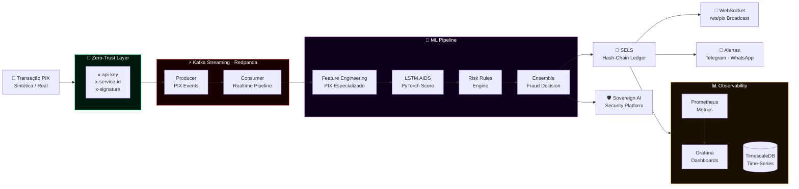
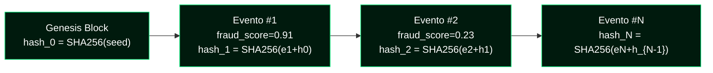

<p align="center">
  
</p>

<p align="center">
  
  
  
  
  
</p>

<p align="center">
  
  
  
  
  
</p>

<p align="center">
  
  
  
  
  
</p>

<p align="center">
  <a href="https://git.io/typing-svg">
    
  </a>
</p>

---

## 📑 Índice

- [Visão Geral](#-visão-geral)
- [Arquitetura em Tempo Real](#-arquitetura-em-tempo-real)
- [Stack Tecnológico](#-stack-tecnológico)
- [Estrutura do Projeto](#-estrutura-do-projeto)
- [Módulos Principais](#-módulos-principais)
- [Quick Start](#-quick-start)
- [Serviços & Portas](#-serviços--portas)
- [Endpoints PIX](#-endpoints-pix)
- [Modelo LSTM AIDS](#-modelo-lstm-aids)
- [SELS — Ledger Imutável](#-sels--ledger-imutável)
- [Zero-Trust Security](#-zero-trust-security)
- [Alertas em Tempo Real](#-alertas-em-tempo-real)
- [Observabilidade](#-observabilidade)
- [Integração Sovereign AI](#-integração-sovereign-ai)
- [Infraestrutura AWS](#-infraestrutura-aws)
- [Testes](#-testes)
- [Licença](#-licença)

---

## 🟢 Visão Geral

O **PIX Fraud RealTime** é uma plataforma de detecção de fraudes em transações PIX com latência **inferior a 1 segundo**, construída sobre streaming Kafka/Redpanda, modelo LSTM AIDS em PyTorch, zero-trust middleware e um ledger de auditoria imutável baseado em hash-chain (SELS). É uma extensão direta do projeto `Fraud-Master-Bank`, adicionando um módulo PIX especializado para o contexto regulatório brasileiro (BACEN + LGPD).

```
╔══════════════════════════════════════════════════════════════════════════╗
║                      PIX FRAUD REALTIME · VISÃO GERAL                   ║
║                                                                          ║
║   Transação PIX Sintética / Real                                         ║
║        │                                                                 ║
║        ▼                                                                 ║
║   [ Zero-Trust Middleware ] ──► [ Kafka / Redpanda Producer ]           ║
║                                          │                               ║
║                                 ┌────────▼────────┐                     ║
║                                 │  Kafka Consumer  │                     ║
║                                 └────────┬────────┘                     ║
║                                          ▼                               ║
║               [ Feature Pipeline PIX ] ──► [ LSTM AIDS Score ]          ║
║                        │                          │                     ║
║                         └────────────┬────────────┘                     ║
║                                      ▼                                   ║
║                          [ SELS Hash-Chain Ledger ]                     ║
║                                      │                                   ║
║          ┌───────────────────────────┼───────────────────────┐           ║
║          ▼                           ▼                       ▼           ║
║  [ WebSocket Broadcast ]   [ Telegram/WhatsApp Alert ]  [ Prometheus ]  ║
║  [ Sovereign AI Platform ] [ Grafana Dashboard ]        [ TimescaleDB ] ║
╚══════════════════════════════════════════════════════════════════════════╝
```

---

## 🏗️ Arquitetura em Tempo Real



---

## 🛠️ Stack Tecnológico

```
╔══════════════════════════════════════════════════════════════════════╗
║  CAMADA               TECNOLOGIAS                                    ║
╠══════════════════════════════════════════════════════════════════════╣
║  API & Streaming      FastAPI · Uvicorn · WebSocket                  ║
║                       Kafka (Redpanda) Producer/Consumer             ║
╠══════════════════════════════════════════════════════════════════════╣
║  Machine Learning     PyTorch LSTM (AIDS model)                      ║
║                       Feature Pipeline PIX especializado             ║
║                       Feature Store · Scaler JSON                    ║
╠══════════════════════════════════════════════════════════════════════╣
║  Storage              TimescaleDB (PostgreSQL time-series)           ║
║                       SELS — Secure Event Ledger (hash-chain)        ║
╠══════════════════════════════════════════════════════════════════════╣
║  Segurança            Zero-Trust Middleware (API Key + Service ID)   ║
║                       SELS Hash-Chain · Assinatura opcional          ║
║                       LGPD Compliance · Eventos anonimizados         ║
╠══════════════════════════════════════════════════════════════════════╣
║  Alertas              Telegram Bot API                               ║
║                       WhatsApp Business API                          ║
╠══════════════════════════════════════════════════════════════════════╣
║  Observabilidade      Prometheus · Grafana Dashboards                ║
║                       Latência p99 · Throughput · Fraud Rate         ║
╠══════════════════════════════════════════════════════════════════════╣
║  Infraestrutura       Terraform · AWS sa-east-1 (Brasil)             ║
║                       Docker · Docker Compose                        ║
╠══════════════════════════════════════════════════════════════════════╣
║  Integração           Sovereign AI Security Platform (webhook)       ║
║                       Fraud-Master-Bank (base reutilizada)           ║
╚══════════════════════════════════════════════════════════════════════╝
```

---

## 📂 Estrutura do Projeto

<details>
<summary><b>🗂️ Expandir estrutura completa</b></summary>

```
PIX-Fraud-RealTime/
│
├── 🧠 src/
│   ├── Backend/               # Infraestrutura base (Fraud-Master-Bank)
│   ├── db/                    # Modelos de banco e migrações
│   │
│   ├── pix/                   # ★ Módulo PIX especializado
│   │   ├── api/               # Routers FastAPI PIX
│   │   ├── mock/              # Mock de transações PIX sintéticas (padrões BR)
│   │   ├── features/          # Feature engineering PIX
│   │   ├── feature_store/     # Cache de features para scoring <1s
│   │   ├── ml/
│   │   │   ├── aids_lstm.py   # Arquitetura LSTM AIDS (PyTorch)
│   │   │   └── train_lstm.py  # Treinamento + export do checkpoint .pt
│   │   ├── security/          # Zero-Trust middleware + SELS hash-chain
│   │   ├── services/          # Processamento, scoring, alertas, métricas
│   │   ├── streaming/         # Kafka Producer/Consumer PIX
│   │   └── ws/                # WebSocket broadcast de decisões PIX
│   │
│   └── sovereign/             # Integração Sovereign AI Security Platform
│
├── 🤖 models/
│   └── aids_scaler.json       # Scaler serializado do modelo LSTM
│
├── 📊 prometheus/             # Configuração Prometheus (scrape configs)
├── 📈 grafana/
│   ├── dashboards/            # Dashboards JSON pré-provisionados
│   └── provisioning/          # Auto-provisionamento Grafana
│
├── ☁️ infrastructure/
│   └── terraform/             # IaC AWS sa-east-1 (módulo mínimo)
│
├── 🐳 docker/                 # Dockerfiles por serviço
├── 📓 notebooks/              # Análise exploratória e experimentos
├── 🧪 tests/                  # pytest (inclui validação de latência <1s)
├── ⚙️ config/                 # Configurações por ambiente
│
├── docker-compose.yml
├── pyproject.toml
├── requirements.txt
└── .env.example
```

</details>

---

## 🔧 Módulos Principais

<details>
<summary><b>📡 src/pix/streaming — Kafka Producer/Consumer</b></summary>

Pipeline de streaming em tempo real com Kafka (Redpanda):

- **Producer**: publica eventos PIX sintéticos ou reais no tópico Kafka com metadados de risco
- **Consumer**: consome o tópico e aciona o pipeline de features + scoring
- Suporte a cenários de carga configuráveis: `transactions_per_second`, `duration_seconds`, `fraud_ratio`

</details>

<details>
<summary><b>⚙️ src/pix/features — Feature Engineering PIX</b></summary>

Features especializadas para o domínio PIX brasileiro:

| Feature | Descrição |
|---|---|
| `device_trust_score` | Score de confiança do dispositivo |
| `failed_auth_count_24h` | Autenticações falhas nas últimas 24h |
| `is_new_beneficiary` | Flag de novo beneficiário |
| `velocity_1h` | Volume de transações na última hora |
| `amount_zscore` | Z-score do valor vs. histórico do pagador |
| `hour_of_day` / `day_of_week` | Sazonalidade comportamental |
| `geo_risk_score` | Risco geográfico (cidade/estado) |

</details>

<details>
<summary><b>🔗 src/pix/security — Zero-Trust + SELS</b></summary>

**Zero-Trust Middleware:** toda requisição PIX exige:

```http
x-api-key:     <chave de serviço>
x-service-id:  <identificador do serviço>
x-signature:   <assinatura HMAC opcional>
```

**SELS (Secure Event Ledger System):** cada decisão de fraude gera um registro imutável via hash-chain:

```
event_n.hash = SHA256(event_n.payload + event_{n-1}.hash)
```

Auditável via `GET /api/v1/pix/sels/verify`.

</details>

<details>
<summary><b>🛡️ src/sovereign — Sovereign AI Integration</b></summary>

Quando fraude é detectada, o módulo envia um evento anonimizado para a Sovereign AI Security Platform com:

- Perfil de compliance BR/LGPD
- Score e reason codes sem dados pessoais
- Timestamp e hash SELS para correlação forense

Configure via `.env`: `SOVEREIGN_PLATFORM_WEBHOOK` e `SOVEREIGN_PLATFORM_TOKEN`.

</details>

---

## 🚀 Quick Start

### Pré-requisitos

```bash
Docker Desktop  >= 24.x
docker compose  >= 2.x
Python          >= 3.11    # para execução local
```

### ⚡ Stack Completa com Docker

<table>
<tr>
<th>🐧 Linux / macOS</th>
<th>🪟 Windows (PowerShell)</th>
</tr>
<tr>
<td>

```bash
# 1. Clone
git clone https://github.com/maykonlincolnusa/\
PIX-Fraud-RealTime.git
cd PIX-Fraud-RealTime

# 2. Variáveis de ambiente
cp .env.example .env
# Configure Telegram, WhatsApp e Sovereign

# 3. Subir stack completa
docker compose up -d --build
```

</td>
<td>

```powershell
# 1. Clone
git clone https://github.com/maykonlincolnusa/`
PIX-Fraud-RealTime.git
cd PIX-Fraud-RealTime

# 2. Variáveis de ambiente
Copy-Item .env.example .env
# Configure Telegram, WhatsApp e Sovereign

# 3. Subir stack completa
docker compose up -d --build
```

</td>
</tr>
</table>

---

## 🌐 Serviços & Portas

| Serviço | URL / Endereço | Descrição |
|---|---|---|
| ⚡ **API REST** | http://localhost:8000 | FastAPI principal |
| 📄 **Swagger UI** | http://localhost:8000/docs | Documentação interativa |
| 🔌 **WebSocket PIX** | `ws://localhost:8000/ws/pix` | Broadcast realtime de decisões |
| 📈 **Prometheus** | http://localhost:9090 | Métricas brutas |
| 📊 **Grafana** | http://localhost:3000 | Dashboards (`admin/admin`) |
| 🗄️ **TimescaleDB** | `localhost:5432` | Série temporal de eventos |
| 🔴 **Redpanda** | `localhost:9092` | Kafka-compatible broker |

---

## 📡 Endpoints PIX

> Todos os endpoints `POST /api/v1/pix/*` exigem headers Zero-Trust obrigatórios.

| Método | Endpoint | Descrição |
|---|---|---|
| `POST` | `/api/v1/pix/score` | Score de fraude online (<1s) |
| `POST` | `/api/v1/pix/mock/publish` | Publicar stream sintético no Kafka |
| `GET` | `/api/v1/pix/sels/verify` | Verificar integridade do SELS hash-chain |
| `GET` | `/api/v1/pix/alerts` | Listar alertas de fraude PIX |
| `GET` | `/ws/pix` | WebSocket — broadcast realtime |
| `GET` | `/health` | Health check |
| `GET` | `/metrics` | Prometheus metrics |

### Exemplo — Score Online

```bash
curl -X POST http://localhost:8000/api/v1/pix/score \
  -H "Content-Type: application/json" \
  -H "x-api-key: local-dev-key" \
  -H "x-service-id: ops-console" \
  -d '{
    "payer_id":              "payer_1001",
    "payee_id":              "payee_9001",
    "amount":                23500,
    "city":                  "Sao Paulo",
    "state":                 "SP",
    "is_new_beneficiary":    true,
    "device_trust_score":    0.31,
    "failed_auth_count_24h": 4
  }'
```

**Resposta esperada:**

```json
{
  "transaction_id":  "PIX-20250318-0042a7",
  "fraud_score":     0.91,
  "decision":        "BLOCK",
  "latency_ms":      87,
  "reason_codes":    ["RC-NEW-BENEFICIARY", "RC-HIGH-VELOCITY", "RC-LOW-DEVICE-TRUST"],
  "sels_hash":       "a3f8c2d1e9b47...",
  "alert_dispatched": true,
  "timestamp":       "2025-03-18T14:22:03Z"
}
```

### Exemplo — Publicar Stream Sintético

```bash
curl -X POST http://localhost:8000/api/v1/pix/mock/publish \
  -H "x-api-key: local-dev-key" \
  -H "x-service-id: ops-console" \
  -H "Content-Type: application/json" \
  -d '{
    "transactions_per_second": 20,
    "duration_seconds":        60,
    "fraud_ratio":             0.12
  }'
```

---

## 🤖 Modelo LSTM AIDS

```
╔══════════════════════════════════════════════════════════════════════╗
║  LSTM AIDS (Anomaly Intrusion Detection System) · PyTorch            ║
╠══════════════════════════════════════════════════════════════════════╣
║  Arquitetura    LSTM bidirecional + camada densa de classificação    ║
║  Entrada        Sequência de features PIX normalizadas (scaler JSON) ║
║  Saída          Probabilidade de fraude [0.0 – 1.0]                 ║
║  Threshold      Configurável via .env (default: 0.72)               ║
║  Latência       <50ms de inferência (excluindo feature pipeline)     ║
╚══════════════════════════════════════════════════════════════════════╝
```

**Treinar novo checkpoint:**

```bash
# Local
python -m src.pix.ml.train_lstm

# Artefatos gerados
# models/aids_lstm.pt          ← checkpoint PyTorch
# models/aids_scaler.json      ← parâmetros de normalização
```

---

## 🔗 SELS — Ledger Imutável

O **Secure Event Ledger System** garante cadeia de custódia forense para cada decisão de fraude:

```
╔══════════════════════════════════════════════════════════════════════╗
║  SELS HASH-CHAIN                                                     ║
╠══════════════════════════════════════════════════════════════════════╣
║  Algoritmo      SHA-256 encadeado (hash_n = SHA256(payload + h_{n-1})║
║  Storage        data/sels_ledger.jsonl  (append-only local)          ║
║                 Tabela SQL: sels_events  (PostgreSQL)                ║
║  Verificação    GET /api/v1/pix/sels/verify                          ║
║  Auditoria      Cada evento: timestamp · decision · hash · score     ║
╚══════════════════════════════════════════════════════════════════════╝
```



---

## 🔐 Zero-Trust Security

```
╔══════════════════════════════════════════════════════════════════════╗
║  ZERO-TRUST MIDDLEWARE · HEADERS OBRIGATÓRIOS                        ║
╠══════════════════════════════════════════════════════════════════════╣
║  x-api-key        Chave de acesso por serviço                        ║
║  x-service-id     Identificador único do serviço chamante            ║
║  x-signature      Assinatura HMAC opcional (quando habilitado)       ║
╠══════════════════════════════════════════════════════════════════════╣
║  PRINCÍPIOS       Never trust, always verify                         ║
║                   Least privilege por service-id                     ║
║                   Audit trail SELS para cada decisão                 ║
║  COMPLIANCE       LGPD: eventos anonimizados antes do envio externo  ║
╚══════════════════════════════════════════════════════════════════════╝
```

---

## 🚨 Alertas em Tempo Real

Configure no `.env` para receber alertas instantâneos quando fraude é detectada:

```bash
# Telegram
TELEGRAM_BOT_TOKEN=<token-do-bot>
TELEGRAM_CHAT_ID=<id-do-chat>

# WhatsApp Business API
WHATSAPP_API_URL=<url-da-api>
WHATSAPP_TOKEN=<token>
WHATSAPP_TO=<numero-destino>
```

**Payload de alerta enviado:**

```
🚨 FRAUDE PIX DETECTADA
━━━━━━━━━━━━━━━━━━━━━━
Score:    0.91 (HIGH RISK)
Decisão:  BLOCK
Motivos:  RC-NEW-BENEFICIARY · RC-HIGH-VELOCITY
SELS:     a3f8c2d1...
Latência: 87ms
Hora:     2025-03-18 14:22:03
```

---

## 📊 Observabilidade

```
╔══════════════════════════════════════════════════════════════════════╗
║  MÉTRICAS PROMETHEUS                                                 ║
╠══════════════════════════════════════════════════════════════════════╣
║  pix_fraud_score_histogram   Distribuição de scores em tempo real    ║
║  pix_decision_total          Contador: BLOCK · ALLOW · REVIEW        ║
║  pix_latency_p99_ms          Latência p99 do pipeline completo       ║
║  pix_throughput_tps          Transações por segundo processadas      ║
║  pix_kafka_lag               Lag do consumer Kafka                   ║
║  sels_events_total           Total de eventos no ledger SELS         ║
╚══════════════════════════════════════════════════════════════════════╝
```

Grafana pré-provisionado com dashboards em `grafana/dashboards/` — zero configuração manual após `docker compose up`.

---

## 🛡️ Integração Sovereign AI

Ao detectar fraude, o módulo `src/sovereign` envia evento anonimizado para a **Sovereign AI Security Platform**:

```bash
# .env
SOVEREIGN_PLATFORM_WEBHOOK=https://sovereign.example.com/ingest
SOVEREIGN_PLATFORM_TOKEN=<token>
```

O payload respeita LGPD: nenhum dado pessoal é transmitido — apenas score, reason codes, hash SELS e compliance profile `BR/LGPD`.

---

## ☁️ Infraestrutura AWS

<details>
<summary><b>🌩️ Deploy Terraform · sa-east-1 (Brasil)</b></summary>

```bash
cd infrastructure/terraform

# Copiar variáveis
cp terraform.tfvars.example terraform.tfvars
# Edite: region, VPC CIDR, instâncias, etc.

# Inicializar e aplicar
terraform init
terraform plan
terraform apply
```

Região padrão: **`sa-east-1` (São Paulo)** — menor latência para clientes brasileiros e conformidade com LGPD de armazenamento de dados no Brasil.

</details>

---

## 🧪 Testes

```bash
# Suíte completa
pytest

# Com cobertura
pytest --cov=src --cov-report=html

# Validação de latência <1s (teste crítico)
pytest tests/test_pix_latency.py -v
```

> O teste de latência valida que o pipeline completo — desde a requisição até a resposta com score — é concluído em **menos de 1 segundo** sob carga normal.

---

## 📄 Licença

```
MIT License · Copyright (c) 2025 Maykon Lincoln
Uso comercial permitido com preservação do aviso de copyright.
```

---

## 👤 Autor

<p align="center">
  <a href="https://github.com/maykonlincolnusa">
    
  </a>
  
  
  
  
</p>

<p align="center">
  <b>Senior Systems Engineer & AI Architect</b><br/>
  Enterprise AI/ML · Cybersecurity · Real-Time Systems · Cloud Infrastructure
</p>

---

<p align="center">
  
</p>

<p align="center">
  <sub>Decisão em &lt;1s · Ledger imutável · Zero-Trust nativo · LGPD compliant</sub>
</p>
