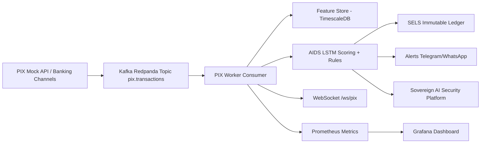

# PIX-Fraud-RealTime Architecture

## Latency target
- End-to-end scoring path: `< 1s`
- Rule-based scoring and feature retrieval optimized for 24h lookback window indexes.

## Security baseline
- Zero-trust headers (`x-api-key`, `x-service-id`, optional `x-signature` HMAC).
- Immutable ledger (`SELS`) with hash chaining and database persistence.
- Data residency profile: Brazil (`sa-east-1` Terraform default).
